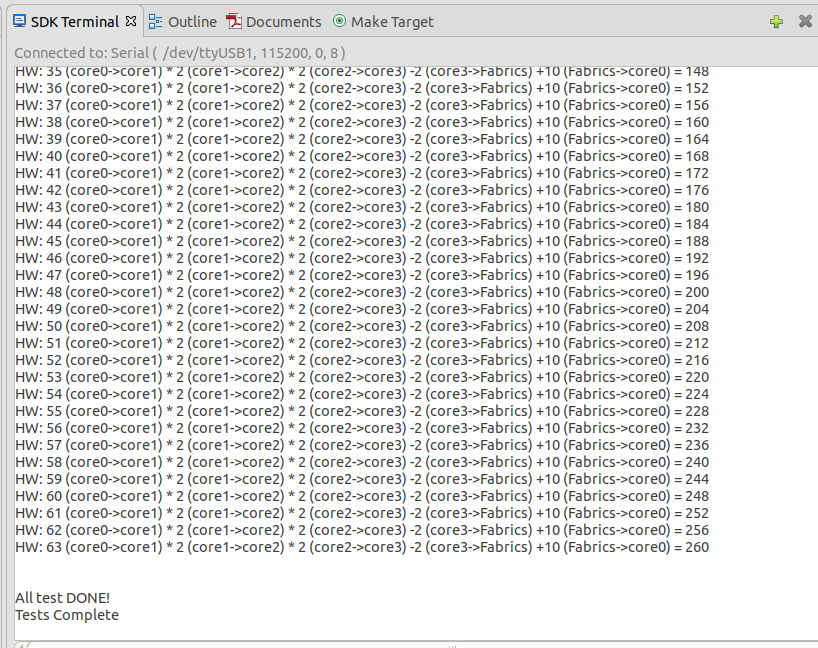
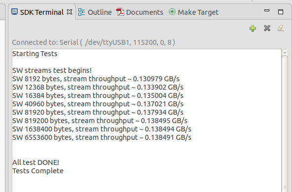
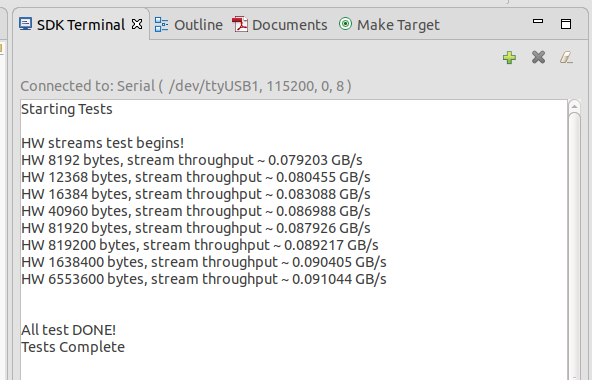

# Estream Demo
## Description 
This is a tutorial to show how to use software (SW) stream links and hardware
(HW) stream links to connect 4 ARM cores and FPGA fabrics together. The 4 ARMs
can communicate with each other by SW streams. The FPGA fabrics and ARMs can communicate
with each other by HW streams. For this demo, the data sent by core0 will go through
core1, core2, core3 and final get back to core0, as figure below. 

  
*(These images aren't coming up inline in the anonymizer; click on the link text to see the image.)*

By using SW streams, core0 will final get data_send\*2\*2-2. If we use HW streams,
the **my_design** in the FPGA fabrics will add extra 10 to the data. By using HW 
streams, the core0 will finally get data_send\*2\*2-2+10.
 

## Tutorial 1
1. The demo is developed with vivado 2018.3 and Xilinx SDK 2018.3. You can install
[vivado 2018.3](https://www.xilinx.com/support/download/index.html/content/xilinx/en/downloadNav/vivado-design-tools/archive.html).
2. The out-of-box vivado does not include u96-v2 board definition. You can download
the bdf from [here](https://github.com/Avnet/bdf). Copy **./ultra96v2** to **\<Vivado directory\>/Vivado/2018.3/data/boards/board_files/**.
3. In the terminal, source your settings.sh file according to your vivado installation area.
location.
```c
source /opt/Xilinx/Vivado/2018.3/settings64.sh
```
4. In the home directory of this repo, type **make**. The final SDK project could
be found under **estream4fccm2021/workspace/vivado_prj/u96_demo/u96_demo.sdk**.
5. Launch Xilinx SDK by type **xsdk**. If you open a new terminal, you should
source the settings64.sh file again as step 3.
6. Set the SDK workspace to **estream4fccm2021/workspace/vivado_prj/u96_demo/u96_demo.sdk**.
7. Build the 4 SDK projects manually for the 4 ARM cores.
  * From Welcome Stream: Create Application Project (any name)
  * File>Import Projects From File System
    *  and point to **estream4fccm2021/workspace/vivado_prj/u96_demo/u96_demo.sdk**.
  * Project > Build All	


8. Before running the 4 cores, we should connect the UART to the board. Click the green
plus sign in **SDK Terminal** console. 


Select the right UART port.


9. Try to launch on hardware once to let SDK automatically create a run configuration.
We can modify it next.


10. Click Run->Run Configurations. Make sure you check **Reset entire system**, 
**Reset APU**, and **Program FPGA**.


10. Select **Application** tab, and select the elf for 4 cores.


11. Click **Run**. You should see the results in **SDK Terminal** console.



12. Sometimes you may get tcf sever errors as below. Just rerun the project. We believe it is a bug from Xilinx SDK.


## Tutorial 2
The Tutorial 1 can show you how to run the software ARM cores. This tutorial will
show you how to modify the FPGA Fabrics.
1. Open the vivado project under **estream_fccm2021/estream4fccm2021/workspace/vivado_prj/u96_demo**.
  * from command line: vivado &
  * Open Project and select `estream_fccm2021/estream4fccm2021/workspace/vivado_prj/u96_demo/u96_demo.xpr`
  * Open Block Diagram


2. You can see **my_design** module in the block diagram. Open the corresponding
verilog file (under source, select `my_design.v`), you can see the data is increased by 10. You can modify the verilog by adding 100.


3. Recompile the vivado vivado project. You may have some frequency attributes errors (or lack of clock).
 * Double click the stream port for **my_design** module, and change the frequency 
attributes to 300000000.
 * Do this for both ports (s_axis and m_axis)


4. Run Synthesis. You can ignore error about OCM error as below.


Or you can inclue the OCM as below.


5. Run Implementation.

6. Generate Bistream.

7. After compilation, export the hdf file as below.


Check including bitstream.


8. Go back to SDK project, and update the hdf files by clicking OK.


9. Recompile every SDK projects for the 4 cores and launch the hardware debugging
as step 10 in tutorial 1. You should see the core0 will final get data_send\*2\*2-2+100.


## Tutorial 3
This tutorial will show you how to measure the throughput of SW stream and HW stream.
We will measure the througuput between core0 and core1. These 2 cores can be connected
by either SW stream or HW stream.

1. Open main.cc file under **core0->src->main.cc**. Comment **#define TEST_MODE CIRCLE**
and uncoment **#define TEST_MODE SW_THP**. Make the same changes for core1-3.


2. Open kernel0.cc file under **core0->src->kernel0.cc**. Increase **DATA_BYTE_SIZE** from 1024 to 1024000.
Make the same changes for core1.


3. Change the Optimization level from **O0** to **O3**. You can right click project core0 and choose properties.


Click **C/C++ Build->Settings->ARM v8 g++ compiler->Optimization** as below.
Make the same changes for core1-3.


4. Rebuild core0-3 project. Click **Run->Run Configurations->Run** again to lauch on hardware as Tutorial Step 9-11.
You should see the SW throughput between 



5. Open main.cc file under **core0->src->main.cc**. Comment **#define TEST_MODE SW_THP**
and uncoment **#define TEST_MODE HW_THP**. Make the same changes for core1-3.


6. Rebuild core0-3 project. Click **Run->Run Configurations->Run** again to lauch on hardware as Tutorial Step 9-11.
You should see the HW throughput between 




7. The data transimission size may affect the throughput. The table bellow shows how the throughput changes with various transfer sizes.

| #Transfer Size | #SW stream | #HW Stream |
|:--------------:|:----------:|:----------:|
|512\*64bits     |0.73 GB/s   |0.38 GB/s   |
|1024\*64bits    |0.88 GB/s   |0.52 GB/s   |
|1536\*64bits    |0.93 GB/s   |0.57 GB/s   |
|2048\*64bits    |0.97 GB/s   |0.59 GB/s   |
|5120\*64bits    |1.08 GB/s   |0.75 GB/s   |
|10240\*64bits   |1.24 GB/s   |1.01 GB/s   |
|102400\*64bits  |1.49 GB/s   |1.54 GB/s   |
|1024000\*64bits |1.44 GB/s   |1.63 GB/s   |


